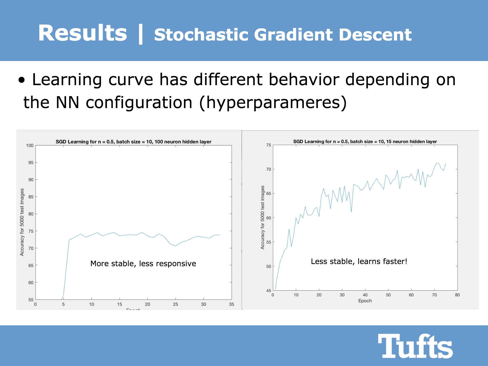

# MNIST Digit Recognition Neural Network
#### Author: Ahmed Gado
#### Date: 05/12/2017

## OVERVIEW
It was finals period, and I was feeling too free. I came up with this challenge:
I created a Neural Net that can recognize handwritten digits and classify them, all written from scratch and without using any libraries. As a challenge, I forbad myself from reading any code, and restricted my research to articles in plain English that describe the ideas behind Neural Nets.

The classifier worked, and reached an accuracy of 84% on the training set! 

This project was submitted as the final project for ES2: MATLAB for Engineers at Tufts University. The Professor who taught the class was Brian Tracey (whom I will always love and appreciate!)

## WHERE TO START

A good starting point is startHere.m, which will guide the user through configuring the running the neural network

## RUN SCRIPTS

1) startHere.m - a script that initializes a neural network and starts learning using SGD

## CALCULATION FUNCTIONS

1) feedFoward.m - this function runs input data through a neural network.
2) guessResult.m - this function guesses the digit of an image using a neural network
3) initializeNetwork.m - this function creates a random neural network with given layers' dimensions
4) meanSquaredError.n - this function calculates how far the neural network's output is from the real/perfect output
5) sigmoid.m - this function calculates the sigmoid value for a scalar input

## DATA/SUPPORT FUNCTIONS

1) getMNISTdata.m - this function returns the MNIST data used for learning
2) loadMNISTImages.m & loadMNISTLabels.m - these functions manage low level file reading for MNIST data set
         These functions are the only foreign code used. Source: http://ufldl.stanford.edu/wiki/index.php/Using_the_MNIST_Dataset
3) saveNeuralNet.m - this function saves a .nng file containing all the neural network data. At some time in the future, I will make a loadNeuralNet function!

### Licensing

* See [LICENSE](LICENSE).
